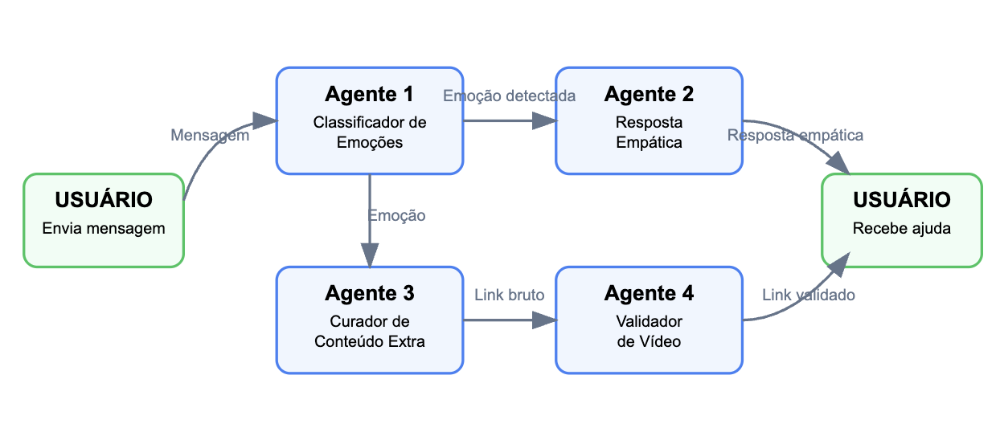

#  EscutAI – Agente de Primeiros Socorros Emocionais

### 🤖 Sobre
**EscutAI** é um chatbot inteligente e empático criado com os recursos multi agentes da AI generativa do Gemini.
Ele escuta o que a pessoa está sentindo, identifica sua emoção e responde com acolhimento e empatia, oferecendo conteúdo reconfortante.

**Features:**
* Detecta emoções nas mensagens (tristeza, ansiedade, raiva, etc.)
* Responde com empatia usando IA generativa
* Sugere vídeos do YouTube para relaxamento emocional

**Impacto:**

### ▶️ Demonstração
Utilização por uma criança/adolescente

Utilização por um adulto

### 🏗️ Detalhes - Arquitetura
#### Agentes
* Agente 1: [Classificador de Emoções](agents/emotion_detector.py)
  - Detecta a emoção na mensagem transmitida pelo usuário (tristeza, ansiedade, raiva, etc.)
* Agente 2: [Agente Empático](agents/empathetic_responder.py)
  - Responde ao usuário com empatia de acordo com a sua emoção captada
* Agente 3: [Curador de conteúdo extra](agents/extra_content_provider.py)
  - Busca vídeos relevantes no YouTube de acordo com a emoção do usuário
* Agente 4: [Validator de Vídeo](agents/video_validator.py)
  - Gera uma frase de busca e sugere conteúdo útil como vídeos do YouTube para relaxamento emocional.

#### Fluxo
O usuário insere a sua idade e envia uma mensagem sobre como está se sentindo

O Agente 1 (Classificador de Emoções) identifica qual emoção está presente na mensagem

O Agente 2 (Resposta Empática) usa a emoção identificada para gerar uma resposta empática de acordo com a idade do usuário

O usuário recebe tanto a resposta empática

Enquanto isso, o Agente 3 (Curador de Conteúdo) recebe a emoção e tentar buscar conteúdo relacionado (vídeos do YouTube) de acordo com a idade do usuário

O Agente 4 (Validador de Vídeo) verifica e valida os links obtidos pelo Agente 3

O usuário recebe o link validado do conteúdo extra do Youtube

### 🚀 Como executar
Como pré-requisito para rodar o agente localmente é preciso ter instalado o python 3+:
* [Windows](https://python.org.br/instalacao-windows/)
* [MacOS](https://python.org.br/instalacao-mac/)
* [Linux](https://python.org.br/instalacao-linux/)

**Instruções:**
1. Clone o repositório
2. Abra o diretório em que clonou o repositório (via console)
3. Adicione a sua `GEMINI_API_KEY` no arquivo `environment.txt`
4. Execute os seguintes comandos para instalar as packages necessárias e executar:
   - `pip install -r requirements.txt` ou `python3 -m pip install -r requirements.txt`
   - `python main.py` ou `python3 main.py`

### 📚 Fontes confiáveis utilizadas
- Vídeos do YouTube (busca automatizada com Gemini)
- Redirecionamento para o CVV https://cvv.org.br (apoio emocional real)

---
> 🧠 Porque às vezes, tudo que a gente precisa é alguém (ou algo) que escute de verdade.

---
Projeto para a Imersão IA 3a edição - Alura (Maio 2025)

Autor: Bruno Oliveira
